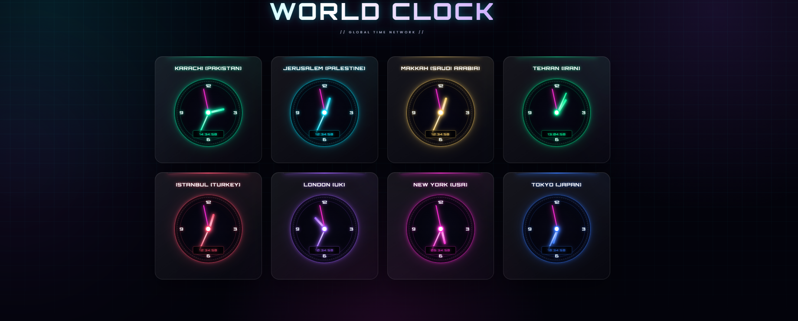

# 🌍 World Clock

A modern and responsive **World Clock web application** that displays real-time clocks for multiple cities around the world.

The project features both **analog and digital clocks**, a dark/neon visual design, and a clean interface built with fundamental frontend web technologies.

---

## ✨ Features

- 🌍 Real-time clocks for multiple cities
- 🕐 Analog clock display
- ⏱️ Digital time display
- 🌎 Multiple international time zones
- 🎨 Modern dark/neon user interface
- 📱 Responsive design
- ⚡ Real-time time updates using JavaScript
- 🧩 Clean and organized frontend structure
- 💻 Built with vanilla web technologies
- 🌐 Works directly in a modern web browser

---

## 🌎 Supported Cities

The application currently displays clocks for:

| City | Country |
|---|---|
| 🇵🇰 Karachi | Pakistan |
| 🇵🇸 Jerusalem | Palestine |
| 🇸🇦 Makkah | Saudi Arabia |
| 🇮🇷 Tehran | Iran |
| 🇹🇷 Istanbul | Türkiye |
| 🇬🇧 London | United Kingdom |
| 🇺🇸 New York | United States |
| 🇯🇵 Tokyo | Japan |

---

## 🛠️ Technologies Used

### Frontend

- **HTML5**
- **CSS3**
- **JavaScript (ES6+)**

### Concepts Used

- JavaScript Date & Time
- Time zone handling
- DOM manipulation
- Real-time UI updates
- CSS animations and styling
- Responsive web design
- Analog clock calculations

---

## 📸 Preview

> Add a screenshot of your World Clock interface here.

```text

